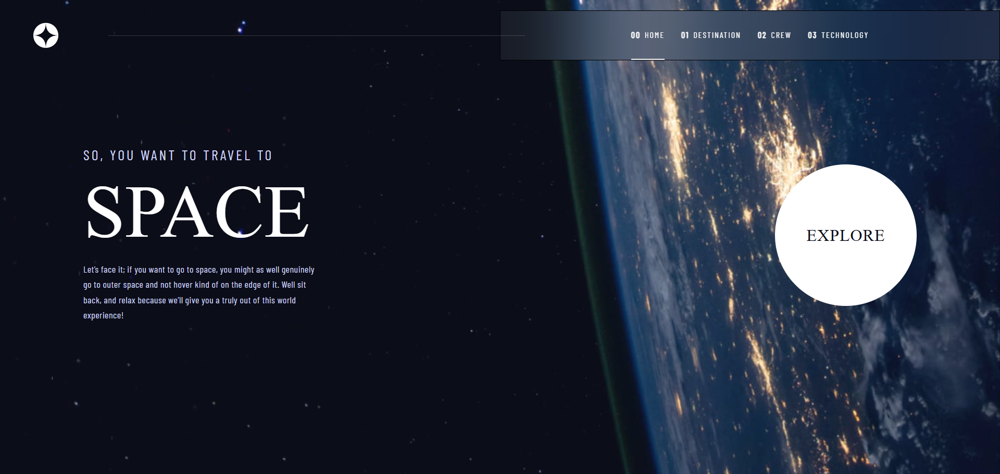
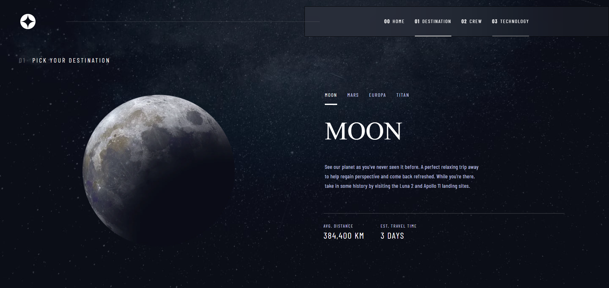
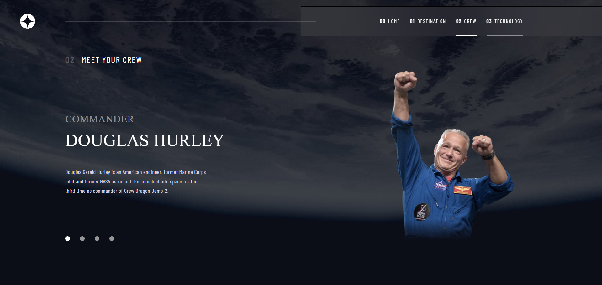
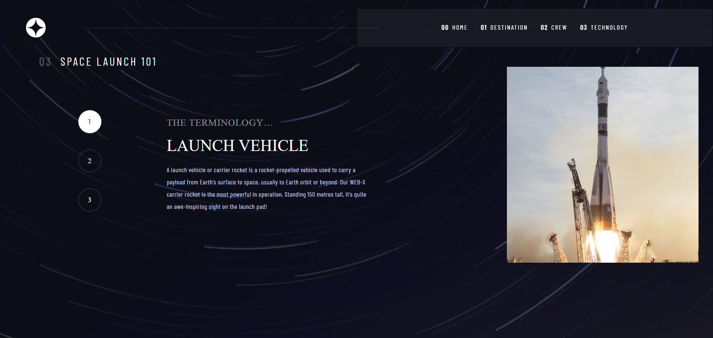

# Frontend Mentor - Space tourism website solution

This is a solution to the [Space tourism website challenge on Frontend Mentor](https://www.frontendmentor.io/challenges/space-tourism-multipage-website-gRWj1URZ3). Frontend Mentor challenges help you improve your coding skills by building realistic projects. 

## Table of contents

- [Overview](#overview)
  - [The challenge](#the-challenge)
  - [Screenshot](#screenshot)
  - [Links](#links)
- [My process](#my-process)
  - [Built with](#built-with)
  - [What I learned](#what-i-learned)
- [Author](#author)


## Overview

### The challenge

Users should be able to:

- View the optimal layout for each of the website's pages depending on their device's screen size
- See hover states for all interactive elements on the page
- View each page and be able to toggle between the tabs to see new information

### Screenshot







### Links

- Solution URL: [Add solution URL here](https://github.com/JuanJo5433/Space-Tourism-WebSite)
- Live Site URL: [Add live site URL here](https://space-tourism-web-site-pearl.vercel.app/)

## My process

### Built with

- Semantic HTML5 markup
- Mobile-first workflow
- [Vite](https://vite.dev/) 
- [React](https://reactjs.org/) - JS library
- [React Router Dom](https://reactrouter.com/) - Routing
- [Tailwind Framework](https://tailwindcss.com/) - For styles


### What I learned

I learned how to animate transitions, how to better manage the responsive for different screen sizes, how to follow requirements and a required layout.

To see how you can add code snippets, see below:


```js
   <div className="flex justify-center my-10 lg:mt-24 relative h-[480px]">
            <AnimatePresence mode="sync">
              <motion.img
                key={urlImg}
                src={urlImg}
                alt={name}
                {...fadeOnly}
                className="absolute w-[150px] h-[150px] md:w-[457px] md:h-[457px] lg:w-[480px] lg:h-[480px] object-contain"
              />
            </AnimatePresence>
          </div>
```


## Author

- Website - [JuanJoDev](https://juanjodev.vercel.app/)
- Frontend Mentor - [@JuanJo5433](https://www.frontendmentor.io/profile/JuanJo5433)
- GitHub - [@JuanJo5433](https://github.com/JuanJo5433)

